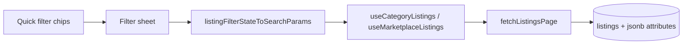

# Marketplace discovery architecture

**Status:** implemented (MVP + Avito-style categories)  
**Scope:** classifieds discovery — 2-level category tree, attributes, quick filters, sort, public view counts. No checkout, shipping, or moderation admin.

## Boundaries

| Domain | Module | Notes |
|--------|--------|-------|
| Marketplace listings | `src/features/listings/` | Buy/sell classifieds, chat conversion |
| Vehicle rentals | `src/features/rentals/` | Separate tables and search (`app/search.tsx`) |
| Real estate | Leaf slugs `real-estate-rent`, `real-estate-sale` | Split from legacy `real-estate` |

See [why-not-used-goods-marketplace-now.md](./why-not-used-goods-marketplace-now.md) for product constraints.

## Category tree (client catalog)

Source of truth: [`src/features/listings/constants/category-tree.ts`](../src/features/listings/constants/category-tree.ts)

- **2 levels:** section (navigation) → leaf slug stored in `listings.category`
- **Hub:** `getHubCategories()` drives Home grid + `app/marketplace/categories.tsx` drill-down
- **Legacy slugs:** `normalizeCategoryId()` maps old slugs (`auto`, `real-estate`, `electronics`, …) to leaf ids
- **DB backfill:** migration `20250629120000_marketplace_category_slugs.sql`

Future: map 1:1 to Supabase `categories (id, parent_id, slug, attribute_schema_key)` when admin editing is needed.

## Data model

```
listings
  ├── category (text leaf slug, e.g. electronics-phones)
  ├── attributes (jsonb) — validated client-side against attribute-fields catalog
  ├── view_count (int) — denormalized counter
  └── price, status, location, ...

listing_view_events
  ├── listing_id, viewer_key (auth uid or anon fingerprint)
  └── dedupe: one count per viewer per listing per 24h
```

## Filter / sort pipeline



**Sort options:** `newest` (default), `price_asc`, `price_desc`, `most_viewed`

**Common filters:** price min/max, location preset or text (`location.ilike`)

**Quick filters:** top 4 select attributes by `filterPriority` (horizontal chips above results)

**Category filters:** select + numeric range (`year`, `mileage`) via `attributes->>key` gte/lte

See [marketplace-attribute-catalog.md](./marketplace-attribute-catalog.md) for per-schema fields.

Location remains plain text — no geo radius in this phase.

## Navigation

| Screen | Route |
|--------|-------|
| Category picker | `app/marketplace/categories.tsx` |
| Leaf browse | `app/browse/[category].tsx` |
| All listings search | `app/(tabs)/marketplace/search.tsx` |
| Transport hub | `app/transport/index.tsx` (buy + rent links) |

## View tracking

1. User opens `app/listing/[id].tsx`
2. App calls `increment_listing_view(listing_id, viewer_key)` (fire-and-forget)
3. RPC inserts into `listing_view_events` if no row in last 24h; increments `listings.view_count`
4. Cards and detail show public count (Eye icon + "N views")

**Assumption:** `viewer_key` = `auth.uid()::text` when signed in, else stable anon id from AsyncStorage (`listing_viewer_key`).

## UX principles

- Functional layout using design-system (`Chip`, `EmptyState`, `GridSkeleton`)
- English UI copy
- Breadcrumb on leaf browse: `CategoryBreadcrumb`
- Dedicated marketplace search (not mixed with scooter search)

## Out of scope

- Payments, escrow, offers, cart
- Admin moderation queue
- Map / lat-lng browse
- Server-side attribute enum enforcement (client Zod only for MVP)

## Follow-ups

- Supabase `categories` table synced from TS catalog
- Full-text search on description + attributes
- Saved searches and filter presets
- Multi-select attribute filters
