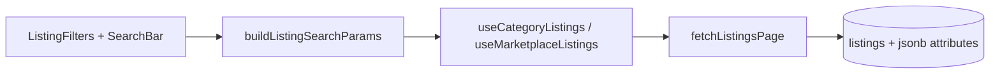

# Marketplace discovery architecture

**Status:** implemented (MVP)  
**Scope:** classifieds discovery — attributes, filters, sort, public view counts. No checkout, shipping, or moderation admin.

## Boundaries

| Domain | Module | Notes |
|--------|--------|-------|
| Marketplace listings | `src/features/listings/` | Buy/sell classifieds, chat conversion |
| Vehicle rentals | `src/features/rentals/` | Separate tables and search (`app/search.tsx`) |
| Real estate | Category `real-estate` inside listings | Not a separate vertical yet |

See [why-not-used-goods-marketplace-now.md](./why-not-used-goods-marketplace-now.md) for product constraints.

## Data model

```
listings
  ├── category (text slug)
  ├── attributes (jsonb) — validated client-side against attribute-fields catalog
  ├── view_count (int) — denormalized counter
  └── price, status, location, ...

listing_view_events
  ├── listing_id, viewer_key (auth uid or anon fingerprint)
  └── dedupe: one count per viewer per listing per 24h
```

## Filter / sort pipeline



**Sort options:** `newest` (default), `price_asc`, `price_desc`, `most_viewed`

**Common filters:** price min/max, `condition` (when category includes it)

**Category filters:** up to 4 `filterable` select attributes from [marketplace-attribute-catalog.md](./marketplace-attribute-catalog.md)

Location remains plain text — no geo radius in this phase.

## View tracking

1. User opens `app/listing/[id].tsx`
2. App calls `increment_listing_view(listing_id, viewer_key)` (fire-and-forget)
3. RPC inserts into `listing_view_events` if no row in last 24h; increments `listings.view_count`
4. Cards and detail show public count (Eye icon + "N views")

**Assumption:** `viewer_key` = `auth.uid()::text` when signed in, else stable anon id from AsyncStorage (`listing_viewer_key`).

## UX principles

- Functional layout using design-system (`Chip`, `EmptyState`, `GridSkeleton`)
- Visual polish deferred — flows and states first
- English UI copy
- Dedicated marketplace search: `app/marketplace/search.tsx` (not mixed with scooter search)

## Out of scope

- Payments, escrow, offers, cart
- Admin moderation queue
- Map / lat-lng browse
- Server-side attribute enum enforcement (client Zod only for MVP)

## Follow-ups

- Server CHECK constraints or `category_attribute_schema` table
- Full-text search on description + attributes
- Saved searches and filter presets
- Seller analytics dashboard (views over time)
